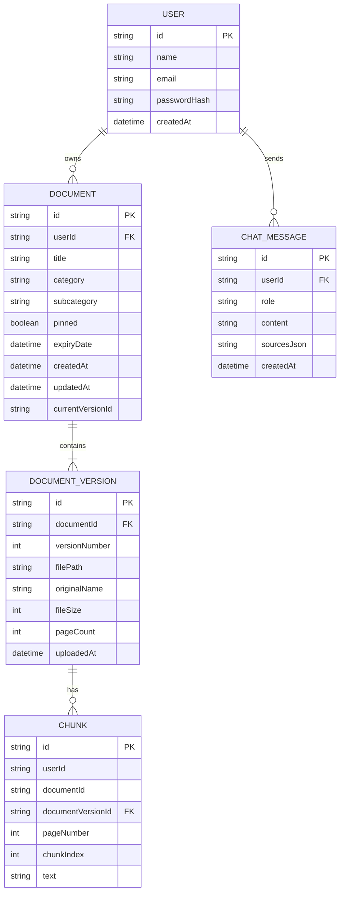

<div align="center">

# 🛡️ DocuMind

### **Your Documents. Organized. Understood.**

*An intelligent, privacy-first personal document vault with grounded AI retrieval, automatic dual-LLM failover, and verified page-level citations.*

---

[](https://nextjs.org/)
[](https://reactjs.org/)
[](https://www.prisma.io/)
[](https://tailwindcss.com/)
[](https://www.anthropic.com/)
[](https://ai.google.dev/)
[](LICENSE)

<br />

[Explore Features](#-key-features) • [System Architecture](#-system-architecture) • [Quick Start](#-quick-start) • [Environment Setup](#-environment-variables) • [Database Schema](#-database-schema) • [API Reference](#-api-reference)

</div>

---

## 📖 Overview

**DocuMind** is a full-stack document intelligence platform designed to eliminate the chaos of managing critical personal and business documents. From insurance policies, identity proofs, and property deeds to vehicle records, employment agreements, and medical reports — DocuMind securely categorizes, versions, and indexes your files.

Powered by a resilient Retrieval-Augmented Generation (RAG) engine, DocuMind allows you to converse naturally with your vault. Every answer generated by the assistant is strictly grounded within your uploaded files and backed by **verifiable, page-level source citations**.

---

## ✨ Key Features

### 🧠 Grounded Document Intelligence (RAG)
- **Zero Hallucination Policy:** Strict prompt engineering ensures the AI answers *only* using facts present in your documents. If an answer isn't in your files, it tells you plainly.
- **Granular Page-Level Citations:** Every response comes with interactive source cards indicating the exact document title and page number referenced.
- **Scanned PDF & Multimodal OCR:** Automatically falls back to Google Gemini's multimodal vision API to transcribe scanned, image-based, or non-selectable PDFs.

### 🔄 Dual-Engine Multi-Model Failover
- **Anthropic Claude (Primary):** Utilizes Claude Sonnet for deep contextual reasoning and nuanced document synthesis.
- **Google Gemini (Automatic Fallback):** Automatically failovers to Gemini 3.5 Flash in real-time if Claude encounters rate limits, network timeouts, or missing keys.
- **Provider Transparency:** The UI displays which engine fulfilled each response.

### 🗂️ Intelligent Document Vault
- **Comprehensive Taxonomy:** 11 pre-configured categories with custom subcategories (Identity, Vehicle, Insurance, Property & Legal, Financial, Education, Employment, Utilities, Medical, Warranty, and Custom).
- **Document Versioning:** Upload updated versions of documents (v1, v2, v3...) while retaining previous file versions and audit history.
- **Version-Pinned Retrieval:** The RAG engine automatically pins search queries to the latest active version of each document, preventing outdated or superseded answers.
- **Expiry & Renewal Tracking:** Dedicated tracking for upcoming document expirations (e.g., passports, insurance policies, vehicle registrations).
- **Pinned Quick Access:** Pin important documents for one-click access directly from your dashboard.

### 🔒 Enterprise-Grade Security & Isolation
- **Multi-Tenant Scoping:** Every single chunk extraction, database lookup, and search scoring query is hard-scoped to the authenticated `userId`.
- **Protected File Streaming:** Document previews and downloads re-verify JWT session ownership before serving file streams.
- **Secure Authentication:** Password hashing via `bcryptjs` and session tokens stored in secure, `httpOnly` signed cookies.

---

## 🏗️ System Architecture

```
                                  ┌───────────────────────────────┐
                                  │      User uploads PDF         │
                                  └──────────────┬────────────────┘
                                                 │
                                  ┌──────────────▼────────────────┐
                                  │       Page-by-Page Parser     │
                                  │  (pdf-parse / Gemini OCR)     │
                                  └──────────────┬────────────────┘
                                                 │
                                  ┌──────────────▼────────────────┐
                                  │   Chunking & Metadata Store   │
                                  │  (Prisma SQLite / PostgreSQL) │
                                  └──────────────┬────────────────┘
                                                 │
  ┌───────────────────────────────┐              │
  │     User Asks Question        │              │
  └──────────────┬────────────────┘              │
                 │                               │
  ┌──────────────▼───────────────────────────────▼────────────────┐
  │     Scoped Lexical Retrieval (BM25-style term overlap)       │
  │         * Strictly filtered by userId & latest version        │
  └──────────────────────────────┬────────────────────────────────┘
                                 │
                 ┌───────────────▼───────────────┐
                 │    Dual-Engine LLM Router     │
                 └───────┬───────────────┬───────┘
                         │ (Primary)     │ (Fallback)
         ┌───────────────▼──────┐ ┌──────▼──────────────┐
         │ Anthropic Claude     │ │ Google Gemini       │
         │ Sonnet               │ │ 3.5 Flash           │
         └───────────────┬──────┘ └──────┬──────────────┘
                         └───────┬───────┘
                                 │
                 ┌───────────────▼───────────────┐
                 │ Grounded Answer with Page Ref │
                 └───────────────────────────────┘
```

### Technology Stack

| Layer | Technology | Description |
| :--- | :--- | :--- |
| **Framework** | Next.js 14 (App Router) | Full-stack React framework with Server Components & API routes |
| **Language** | JavaScript / React 18 | Modern component architecture and interactive clients |
| **Styling** | Tailwind CSS & PostCSS | Custom design tokens, responsive UI, subtle micro-animations |
| **Database** | SQLite / PostgreSQL via Prisma | Type-safe ORM with migration management |
| **Authentication** | Custom Auth (bcryptjs + JWT) | Secure `httpOnly` cookie-based session management |
| **Document Processing** | `pdf-parse` + Gemini Vision OCR | Page-aware text extraction with automatic fallback for scans |
| **AI / LLMs** | Anthropic Claude & Google Gemini | Grounded RAG with automated dual-provider failover |

---

## 📁 Project Structure

```bash
DocuMind/
├── app/
│   ├── api/
│   │   ├── auth/                # Login, signup, logout, session verification
│   │   ├── chat/                # RAG retrieval & dual-LLM response handler
│   │   └── documents/           # Document CRUD, version uploads & file streaming
│   ├── assistant/               # AI Assistant chat interface
│   ├── dashboard/               # Main dashboard (pinned files, recent, expirations)
│   ├── documents/               # Document library, filtering & detail views
│   ├── login/                   # Authentication login view
│   ├── signup/                  # Registration view
│   ├── globals.css              # Global styles and Tailwind imports
│   ├── layout.js                # Root app layout & font configurations
│   └── page.js                  # Landing page
├── components/
│   ├── AppShell.js              # Primary layout shell with sidebar navigation
│   ├── AuthShell.js             # Authentication layout wrapper
│   ├── ChatPanel.js             # Conversational RAG interface with source cards
│   ├── DocuMindLogo.js          # SVG brand icon and typography components
│   └── UploadModal.js           # Multi-step upload & category selection modal
├── lib/
│   ├── auth.js                  # JWT token creation, verification & user resolution
│   ├── categories.js            # Standardized document category & tag taxonomy
│   ├── env-check.js             # Runtime environment variable validation
│   ├── llm.js                   # Anthropic Claude & Google Gemini failover client
│   ├── prisma.js                # Shared Prisma client singleton
│   └── rag.js                   # Text extraction, chunking, OCR fallback & retrieval
├── prisma/
│   ├── schema.prisma            # Database models & relationships
│   └── dev.db                   # Local SQLite database instance
├── public/                      # Static assets & brand graphics
├── tailwind.config.js           # Tailored color palette & design system
├── package.json                 # Dependencies and build scripts
└── README.md                    # Project documentation
```

---

## 🚀 Quick Start

### Prerequisites
- **Node.js**: `v18.17.0` or higher
- **npm**, **pnpm**, or **yarn**
- An API Key for **Anthropic Claude** and/or **Google Gemini**

### Installation

1. **Clone the Repository**
   ```bash
   git clone https://github.com/Sidd1104/DocuMind.git
   cd DocuMind
   ```

2. **Install Dependencies**
   ```bash
   npm install
   ```

3. **Configure Environment Variables**
   ```bash
   cp .env.example .env
   ```
   *Edit `.env` with your API keys (see [Environment Variables](#-environment-variables) below).*

4. **Initialize Database**
   ```bash
   npx prisma db push
   ```

5. **Start Development Server**
   ```bash
   npm run dev
   ```

6. Open [http://localhost:3000](http://localhost:3000) in your browser to create your vault!

---

## 🔑 Environment Variables

Configure the following variables in your `.env` file:

```env
# Database connection (SQLite default, swappable for PostgreSQL/MySQL)
DATABASE_URL="file:./dev.db"

# Secret key for signing JWT auth tokens
AUTH_SECRET="your-secure-random-secret-key-min-32-chars"

# Primary LLM — Anthropic Claude
ANTHROPIC_API_KEY="sk-ant-api03-..."
ANTHROPIC_MODEL="claude-sonnet-5"

# Fallback LLM & OCR Engine — Google Gemini
GEMINI_API_KEY="AIzaSy..."
GEMINI_MODEL="gemini-3.5-flash"
```

---

## 🗄️ Database Schema

DocuMind uses Prisma ORM with the following core relational models:



---

## 🔌 API Reference

### Authentication
- `POST /api/auth/signup` — Register a new account
- `POST /api/auth/login` — Authenticate and receive session cookie
- `POST /api/auth/logout` — Clear session token
- `GET /api/auth/me` — Retrieve active user session

### Documents & Versions
- `GET /api/documents` — List user's documents with metadata
- `POST /api/documents` — Upload new PDF, extract text/OCR, and chunk index
- `GET /api/documents/[id]` — Retrieve specific document metadata and versions
- `PATCH /api/documents/[id]` — Update metadata (category, pin status, expiry)
- `DELETE /api/documents/[id]` — Delete document and associated version files
- `POST /api/documents/[id]/versions` — Upload and index a new version of an existing file
- `GET /api/documents/[id]/file` — Secure authenticated file preview stream

### Intelligent Assistant
- `GET /api/chat` — Retrieve user's conversation history
- `POST /api/chat` — Submit a question, perform user-scoped RAG retrieval, and return grounded response with source citations

---

## 🔒 Security & Privacy

1. **User Isolation:** All document chunks and search indexes are strictly partition-filtered by `userId`.
2. **Version Pinning:** Queries only scan the active version (`currentVersionId`), avoiding stale data retrieval.
3. **No External Training:** Your document contents are never used to train foundational AI models.
4. **Encrypted in Transit & At Rest:** Designed to run with SSL/TLS and secured filesystem/database storage.

---

## 🤝 Contributing

Contributions, issues, and feature requests are welcome!
Feel free to check the [issues page](https://github.com/Sidd1104/DocuMind/issues).

1. Fork the Project
2. Create your Feature Branch (`git checkout -b feature/AmazingFeature`)
3. Commit your Changes (`git commit -m 'feat: Add some AmazingFeature'`)
4. Push to the Branch (`git push origin feature/AmazingFeature`)
5. Open a Pull Request

---

## 📄 License

Distributed under the **MIT License**. See [`LICENSE`](LICENSE) for more information.

<div align="center">
  <sub>Built with ❤️ by <a href="https://github.com/Sidd1104">Siddhant Mohan Jha</a></sub>
</div>
